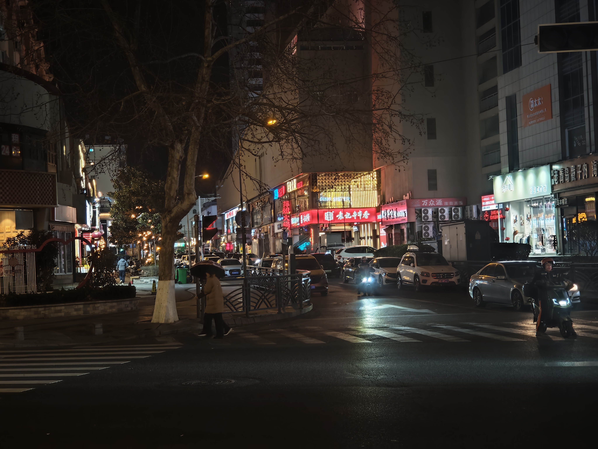

---
title: 胡言乱语
---

**2026/4/13 凌晨 名古屋**

想家.

**2026/4/12 名古屋**

小学的时候想炸小学，
上了中学开始想念小学，想炸中学
上了大学爽了，啥也不想炸了。

现在只想回到大学，和朋友们再喝一杯酒

**2026/4/11 名古屋**

饥饿, 想食大便
贫穷, 想上班

**2026/4/6 名古屋**

我宣布, 人工智能是个笨蛋, 谁都不许害怕它.

**2026/4/5 名古屋**

我想家, 我和这里没有联系. 我用酒精麻痹自己.

我想家, 想回家.

为什么.
  
这辈子说的最多的就是,

为什么.

为什么.

不知道.

人群, 城市, 马路, 变形金刚.

饭店, 酒吧, 路牌, 一堆鞋子.

少年是什么

想念的那条街

确实如此.

晚安.

--

我明天要吃蛋炒饭.

